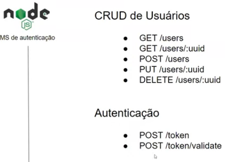

# Explorando o Estilo Arquitetural REST com Node.js

Iremos criar um projeto de um microsserviço de autenticação de usuários.

[GitHub da aplicação do especialista](https://github.com/RenanJPaula/dio-node-user-authentication-api)

## JWT token

- "iss" O domínio da aplicação geradora do token
- "sub" É o assunto do token, mas é muito utilizado para guardar o id do usuario
- "aud" Define quem pode usar o token
- "exp" Data para expiração do token
- "nbf" Define uma data para qual o token não pode ser aceito antes dela
- "iat" Data de criação do token
- "jti" O id do token

## Desafio

Implementar um refresh token

Estudar Biblioteca config para pegar variáveis de ambiente
