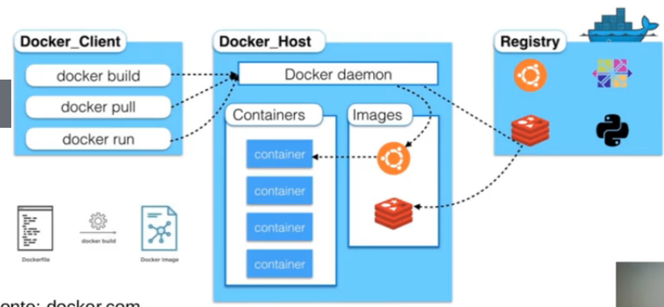
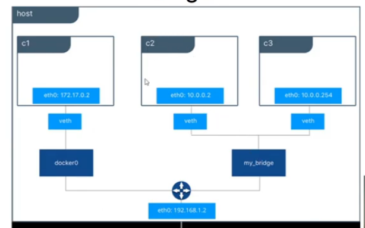
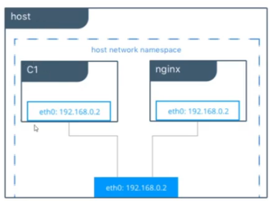
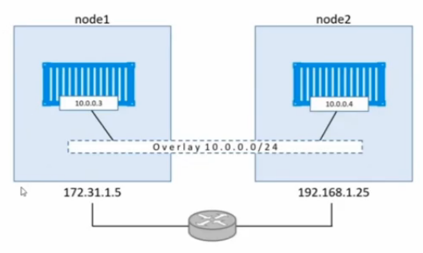
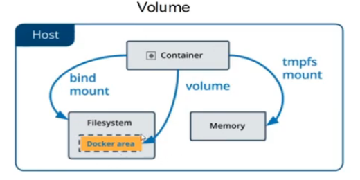
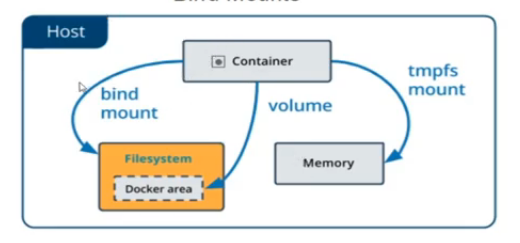
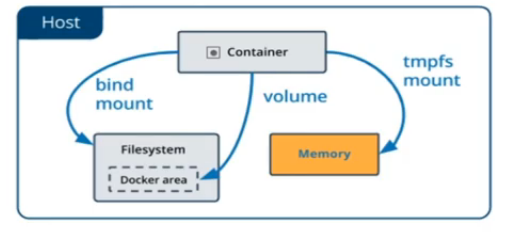

# Introdução a orquestração de contêineres com Docker

## Máquinas Virtuais (VM) e Contêineres

Máquinas virtuais possuem SOs próprios, conteineres compartilham o SO.

VM possuem escalonamento vertical e difícil atualização.

Conteiners possuem escalonamento horizontal e fácil atualização (Docker Swarn ou Kubernetes).

## Arquitetura do Docker

- COnatiner image - contém todas as dependências da imagem do container
- Dockerfile - Arquivo de texto que contém as instruções para construir a imagem
- Build - Ação de construção da imagem a partir do dockerfile
- CONtainer - Uma instância da imagem que representa aexecução de uma aplicação, processo ou serviço
- Volumes - Permite a persistência de dados no disco
- Tag - Ajuda no verisonamneto das imagens
- Multi-stage Build - Construção do container por meio de etapas.
- Repository - biblioteca de imagens
- Registry - Serviço que permite acesso ao repositório
- Docker Hub - repositório público de imagens do docker
- Compose - Permite criar múlitplos containeres com um comando.

Para utilizar o docker online podemos usar o [Play With Docker](https://labs.play-with-docker.com/).

## Instalando o Docker no Linux (Ubuntu)

Seguir os passos da documentação:

https://docs.docker.com/engine/install/ubuntu/

## Principais comandos

- Run
- PS
- Info
- Images
- Exec
- Stop Start
- Logs
- Inspect
- Pull
- Commit
- Tag
- Login Logout
- Push
- Search
- Rm
- Rmi
- Export/Import
- Save/Load

Repositorio da aula:

Verificar as explicações e exemplos para os principais comandos nos arquivos deste repositório.
https://github.com/luistkd4/docker101

## Tipos de Rede

**_Bridge_**

É a rede default do ODcker, utilizado para comunicação entre containers

**_Host_**

Remove o isolamento da rede, o container responde diretamente pela placa de rede do host. Devemos ter cuidado com as portas expostas pelo Host para que não haja conflito com as portas dos containers

**_Overlay_**

Permite a comunicação entre os containers de hosts diferentes por meio de um cluster.

**_Macvlan_**

Permite atribuir um endereço MAC ao container tornando ele visível como um dispositivo físico na rede

**_None_**

Container sem rede alguma

## Armazenamentos no Docker

**_Volume_**

É o tipo preferencial quando utilizamos ambientes replicados. Salva os arquivos em uma pasta da máquina.

**_Bind Mounts_**

**_tmpfs Mounts_**

temporary fileSystem
Temporário, após deletar ou reiniciar o container as informações são deletadas.

## Limites

Podemos atribuir limites aos containeres, tanto no uso de memória como de CPU. Verificar os comandos nos arquivos da pasta ./docker101/ItroComands/Limits
