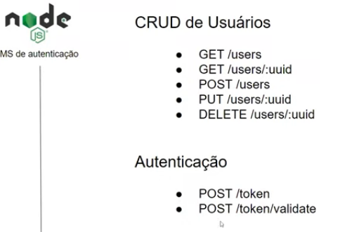

# Explorando o Estilo Arquitetural REST com Node.js

Iremos criar um projeto de um microsserviço de autenticação de usuários.

[GitHub da aplicação do especialista](https://github.com/RenanJPaula/dio-node-user-authentication-api)
