# Fundamentos de Arquitetura de Sistemas

## Serviços Web ou Web Services

São soluções para aplicações se comunicarem, independente de linguagem, software e hardwares utilizados.
Podemos dizer que serviços web são APIs que se comunicam por meio de redes dobre o protocolo HTTP.

- Vantagens

  - Linguagem comum
  - Integração
  - Reutilização de implementação
  - Segurança
  - Custos

- Principais tecnologias
  - SOAP
  - REST
  - XML
  - JSON

### Estrutura SOAP

**O que é SOAP?**

É um protocolo baseado em XML para acessar serviços web, prinsipalmente por HTTP
Pode-se dizer que SOAP é uma definição de como os serviços WEB se comunicam.

- Vantagens
  - Permite integrações independente de linguagens
  - Independente de plataforma e software
  - Meio de transporte genérico ou seja, pode ser usado por outros protocolos além do HTTP

**XML**

É uma linguagem de marcação criada na década de 90 pela W3C

Facilita a separação de conteúdo

Não tem limitação na criação de tags

Linguagem comum para integrações entre aplicações

**Estrutura SOAP**

**_SOAP Envelope_** - primeiro elemento do documento e é usado para encapsular toda a mensagem SOAP

**_SOAP Header_** é o elemento onde possui infirmações de atributos e metadados da requisição

**_SOAP Body_** é o elemento que contém os detalhes da mensagem

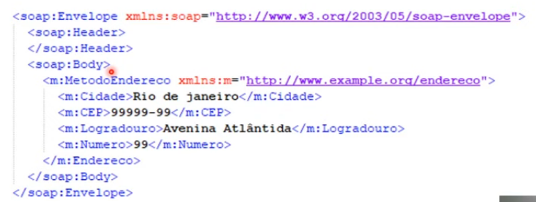

**O que é um WSDL**

- **WSDL** - Web Services Description Language
- Usado para descrever Web Services, funciona como um contrato do serviço
  A descrição é feita em um documento XML, onde é descrito o serviço, especificações de acesso, operações e métodos

**O que é um XSD**

- **XSD** - XML Schema Definition
- É um schema no formato XML usado para definir a estrutura de dados que será validada no XML
- O XSD funciona como uma documentação de como deve ser montado o SOAP Message (XML) que será enviado através de Web Service

**Exemplo de um WSDL:**

http://www.soapclient/xml/soapresponder.wsdl

- **[SoapUI](https://www.soapui.org/)** - ferramenta para facilitar o entendimento do arquivo wsdl

### O que são REST, API e JSON

**O que é REST**

- **_REST_** - Representation State Transfer
- É um estilo de arquitetura de software que define a implementação de um serviço Web
- Podem trabalhar com os formatos XML, JSON, ou outros

- Vantagens
  - Permite integraçẽs entre aplicações e também entre cliente e servidor em páginas web e aplicações
  - Utiliza os métodos HTTP para definit a operação que está sendo efetuada
  - Arquitetura de fácil compreensão

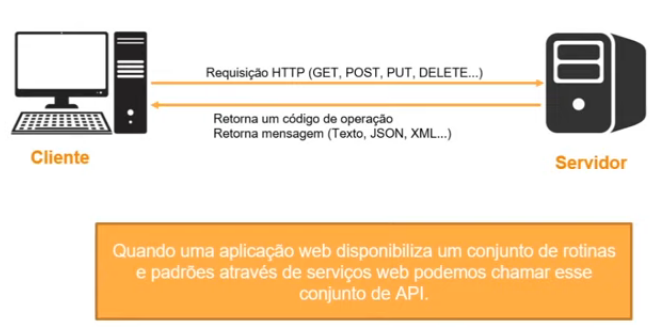

**O que é API**

- **_API_** - Application Programing Interface
- São conjuntos de rotinas documentadas e disponibilizadas por uma aplicação para que outras aplicações possam consimir suas funcionalidades
- Ficou popular com o aumento dos serviços web

**Principais métodos HTTP**

- **GET** - Solicita a representação de um recurso
- **POST** - Solicita a criação de um recurso
- **DELETE** - Solicita a exclusão de um recurso
- **PUT** - Solicita a atualização de um recurso

Para o serviço ser considerado um REST ele deve seguir esta arquitetura utilizando os métodos HTTP conforme acima

**O que é JSON**

- **_JSON_** - Javascript Object Notation
- Formatação leve utilizada para troca de mensagens entre sistemas
- Usa-se de uma estrutura de chave e valor e também de listas ordenadas
- Um dos formatos mais populares e mais utilizados para troca de mensagens entre sistemas

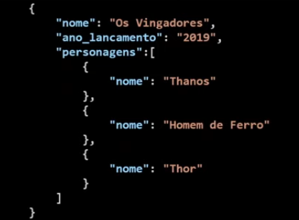

**Códigos de Estado ou Status Code**

- 1xx - Informativo
- 2xx - Sucesso
- 3xx - Redirecionamento
- 4xx - Erro do Cliente
- 5xx - Erro do Servidor

https://developer.mozilla.org/pt-BR/docs/Web/HTTP/Status

## Conceitos de arquitetura em aplicações para Internet

Repositório da aula:
https://github.com/jeffhsta/fundamentos_arquitetura

Sistema de Monolito:

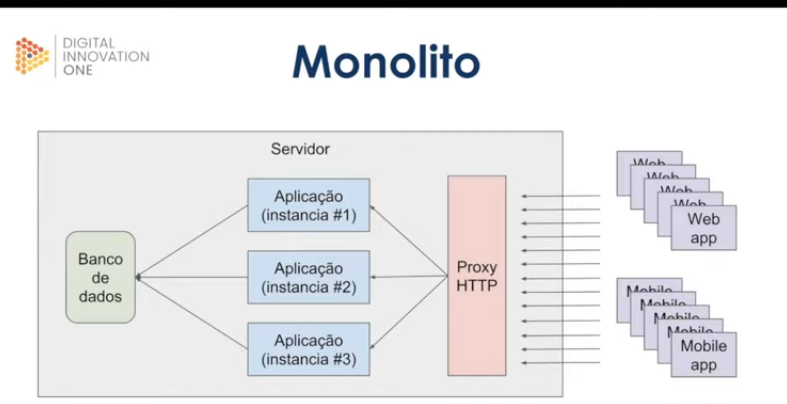

Sistema de Microsserviços:

**_Microsserviços#1_**
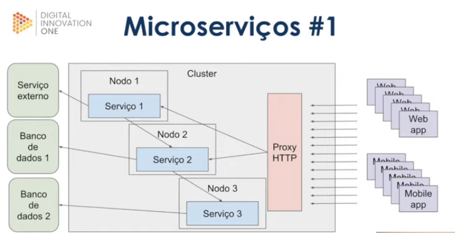

**_Microsserviços#1_**
Incluindo o Message Broker:

Vantagens - O Message Broker gerencia os serviços e se um serviço deixar de operar a aplicação não quebra.

Desvantagens - A aplicação fica dependente do Message Broker, neste caso se o mesmo deixar de operar a aplicação irá quebrar.

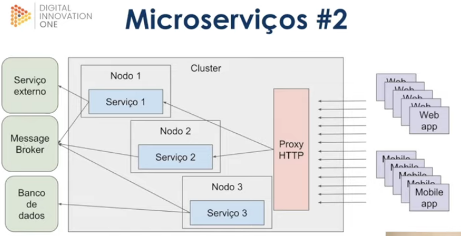

**_Microsserviços#1_**
Incluindo o Gerenciador de Pipeline:

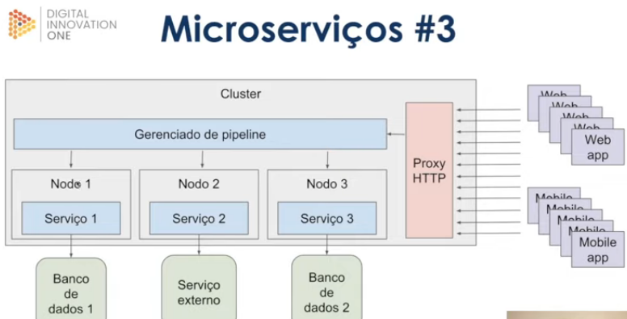

**Comparando modelos de Monolito e Microsserviços**

**_Monolito_**

- Pros:
  - Baixa complexidade
  - Monitoramento simplificado
- COntras;
  - Stack única
  - Compartilhamento de recursos
  - Acoplamento (um serviço depende do outro)
  - Maior complexidade para escalar

**_Microsserviços#1_**

- Pros:
  - Stack dinâmica (podemos usar linguagens específicas para cada serviço)
  - Simples escalabilidade
- COntras;
  - Acoplamento
  - Monitoramento mais complexo
  - Provisionamento mais complexo

**_Microsserviços#2_**

- Pros:
  - Stack dinâmica (podemos usar linguagens específicas para cada serviço)
  - Simples escalabilidade
  - Desacoplamento
- Contras;
  - Monitoramento mais complexo
  - Provisionamento mais complexo

**_Microsserviços#3_**

- Pros:
  - Stack dinâmica (podemos usar linguagens específicas para cada serviço)
  - Simples escalabilidade
  - Desacoplamento
  - Menor complexidade
- Contras;
  - Provisionamento mais complexo
  - Plataforma inteira depende do gerenciador e pipeline

### Gerenciamento de erros e volume de acessos

Onde é mais complexo:

- Processos assíncronos (Microsserviços #2)
- Pipeline

Solução:

- Dead letter queue
- Filas de re-tentativas
- Sistema de rowback (pipeline)

## A arquitetura de aplicaçõs móveis e internet das coisas

**_IOT_** - Internet of Things

- Embutir sensores em objetos do dia-a-dia
- Coletar dados dos sensores
- Usar o dado para tomar decisão

Ex.: Smart Buildings, Smart Homes, Wearables, Agriculture, Smart Transportation, RFID Supply Chain, Enery Efficiency.

**_Computação Ubíqua_**

Mark Weiser - Weiser foi o criador do conceito Computação Ubíqua,[5] defendendo o oposto da Realidade Virtual, em que as pessoas são colocadas dentro do mundo gerado pelo computador. Na Computação Ubíqua, é o computador que se integra a vida das pessoas de modo que elas não o percebam, mas o utilizem. Movido por este conceito, Weiser percebeu que ainda não havia meios tecnológicos na sua época para que a Computação Ubíqua se tornasse realidade, então passou a dedicar esforços para desenvolver estes meios. Um exemplo disso foi a criação de "tabs", "pads", e "boards" pela Xerox PARC entre 1988-1994. A Computação Móvel e os Sistemas Distribuídos também receberam contribuições de Weiser, visando a viabilidade da ubiquidade computacional.

**Desafios**

1. Privaciade e Segurança
2. Quantidade exponencial de dispositivos conectadas na rede
3. Ser capaz de processar e armazenar uma enorme quantidade de informações
4. Gerar valor à partir dos dados coletados

### Arquitetura da Internet das Coisas

**Considerando os atributos:**

- Baixo consumo de energia
- Rede de dados limitada
- Resiliência
- Segurança
- Customização
- Baixo Custo

** Arduino:**

- Plataforma de prototipagem
- Com entradas e saídas
- Desenvolvedor escreve em C/C++
- Interface serial ou USB

** Embarcados:**

- MCUs
- Microcontrolador de chip único
- Sistema operacional real time
- Embarcado
- Uso industrial, médico, militar, transporte

**Minicomputadores**

- Raspberry Pi
- Computador completo
- Hardware integrado em uma única placa
- Roda um sistema operacional
- Uso doméstico e comercial

**Protocolo de Comunicação**

**_MQTT_** - É o protocolo de comunicação mais utilizado.

- Base na pilha do TCP/IP
- Procotolo de mensagem assíncrona (M2M)
- Criado pela IBM para conectar sensores de pipelines de petróelo a satélites
- Padrão OASIS suportado pelas linguagens de programação mais populares

**Modelo Cliente Servidor:**

Comunucação direta entre dispositivo e servidor
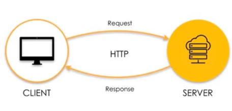

**Modelo Publish/Subscribe:**

Sensores enviam informações ao MQTT Broker que repassa aos dispositivos ou servidores
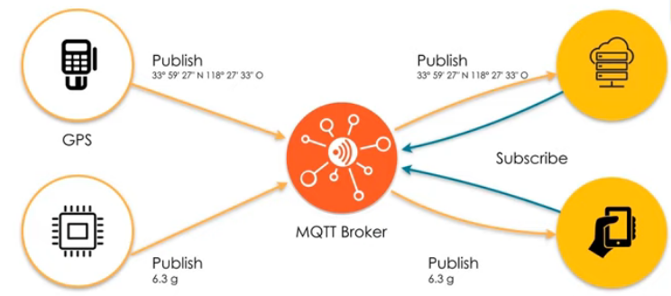

**Publish:**

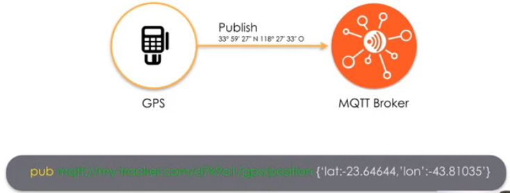

Flexibilidade dos tópicos:

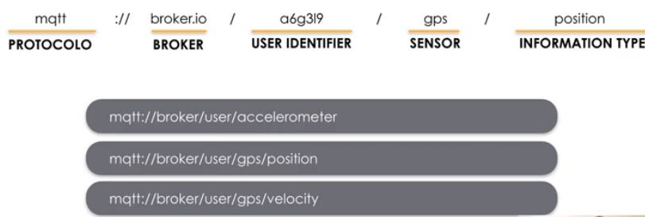

Subscribe:

Capacidade do client (celular, servidor, etc..) de se conectar ao Broker e receber os dados do mesmo.

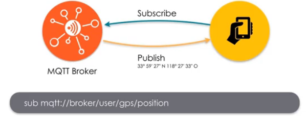

Níveis de garantia:

QoS 0 - Não recebe confirmação de entrega e não retransmite a mensagem. Nível mais baixo e menos custoso

QoS 1- Garante que a mensagem foi recebida pelo menos uma vez ao recebedor e pode retransmitir a mensagem caso a mesma não tenha sido recebida. Nível padrão.

QoS 2 - Garante que a mensagem foi recebida pelo menos uma vez ao recebedor e pode retransmitir a mensagem caso a mesma não tenha sido recebida, guarda a mensagem até que o recebedor receba a mensagem e informa ao MQTT a confirmação de mensagem recebida. Maior nível de garantia

Estudo de Caso:

Selecionando as tecnologias:

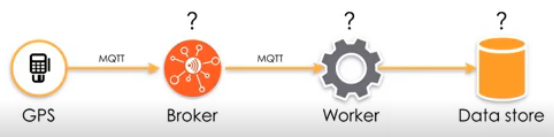

Prova de conceito:

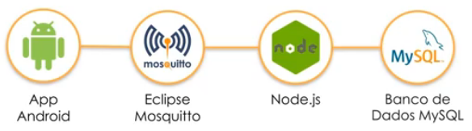

Mínimo Produto Viável:

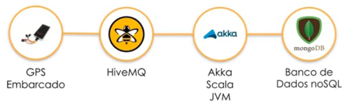

Solução Cloud Native:

Escalabilidade praticamente ilimitada.

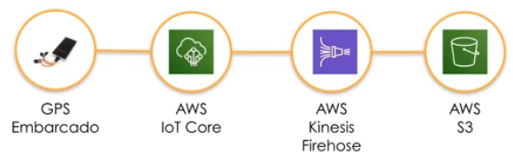

Entregar os dados em realtime:

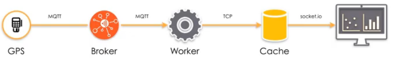

Tecnologias Cloud Native:

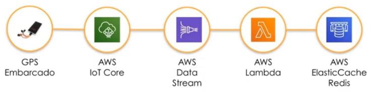

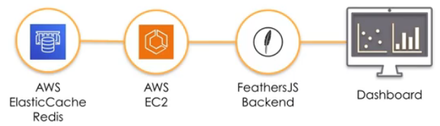
