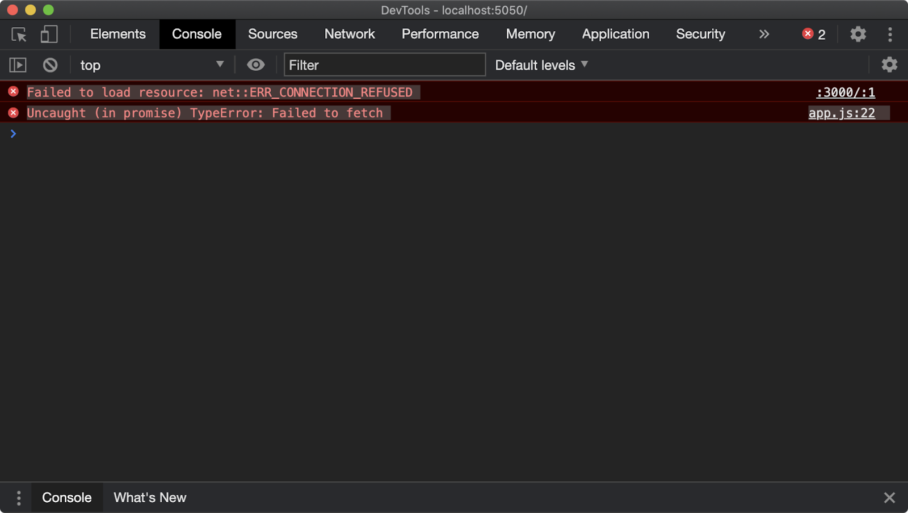
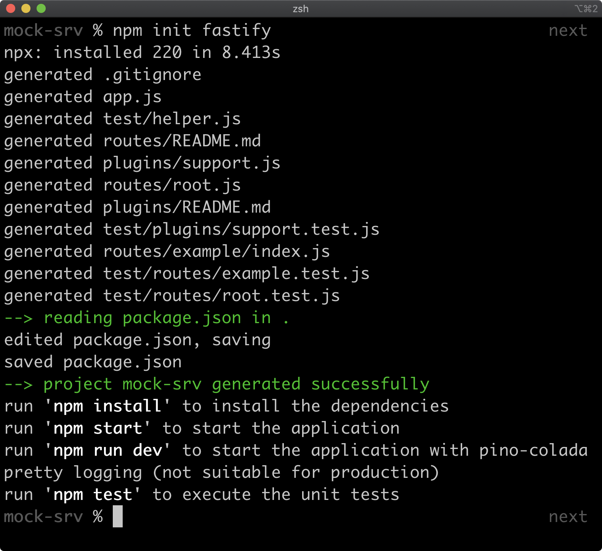
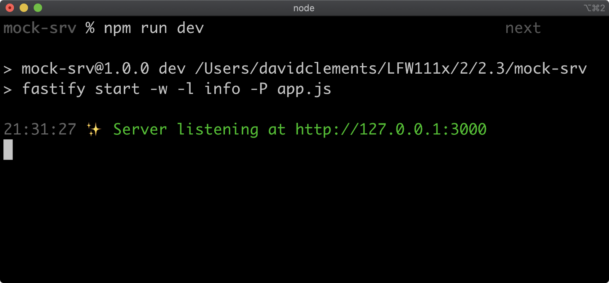

# Introduction to Node.JS

## Instructor: David Mark Clements
 - He’s the author of various Open Source projects. Of note among them is Pino, the fastest Node.js JSON logger available and 0x, a powerful profiling tool for Node.js.

 ## Installing NodeJs in Linux
    The best approach to install NodeJS is using a version manager, in particular `nvm`.
    Package managers such as apt-get tends to lag behind Node.JS faster release cycle. Besides that they also tends to require the use of sudo (a command which grants root privileges) on non-Windows systems. This is not an ideal setup for a developer machine and granting root privileges to the install process of third-party libraries is not a good security practice.  

 Single nvm install command with curl:

 ```
  curl -o- https://raw.githubusercontent.com/nvm-sh/nvm/v0.39.1/install.sh | bash
 ```
    note: check for the latest version and replace it on the url (0.39.1). If using zsh the bash part of the command can be replaced with zsh.


Check if `nvm` is correctly installed:

```
command -v nvm
```

Install node v18

```
nvm install 18
```

## Chapter 2. Service Mocking

Professionally speaking, the ability to rapidly create services with mock data that can run locally is a useful skill. Sometimes we might have limited or even no access to services we're integrating with. Possibly because they've not been created yet or possibly because of slow-performance of staging or down-time or a temporary permissions issue. Sometimes staging environments that we could integrate our local development with are shared among teams and we can end up with unexpected results because another developer has triggered a *state* change in the staging environment. Ideally we could run instances of production services with their own local *state* on our machine and integrate with those. However, organizations haven't always achieved this capability. Another reason for mock services is rapid prototyping, this is especially convenient in situations where client-side development has the advantage of being able to specify the data model. For these situations and probably more besides, we can create mock services. In this chapter we'll explore how to create mock services quickly and efficiently with Node.js.


### Quick File Server

As we proceed, it's assumed that we're working in the same project folder and keeping it as our current working directory throughout this chapter.

Serving files from a folder is very straightforward.

First, we'll install the serve package. In a terminal window, run the following:

npm install -g serve

The -g flag instructs the npm client to install the serve package globally, which means we can run the serve command at any time in our terminal.

To serve a folder we run serve {path} where {path} is a path to the folder we want to serve.

To try this out, let's create a new folder and then place some files inside it. Let's create a folder called static - we can do so with the following command:
```
node -e "fs.mkdirSync('static')"
```
We'll be using node for file system manipulation throughout this course because it's cross-platform. However, you can use any preferred method to create the static folder.

Now we need to put some files in the static folder. We're going to create a small frontend application, which we'll use in the upcoming sections to integrate with the mock services we're going to build.

It's important to understand that the details of the frontend application are immaterial; it's a prop that's going to be used to illustrate the usefulness of mock services. From a conceptual standpoint, the client-side application could just as well be a backend service that is integrating with other upstream services. Therefore we won't spend much time dissecting frontend code except where it pertains to a dataflow between our client and our mocked service.

Check the content of index.html and app.js inside the static folder.

Create a server for this folder and using serve:

```
serve -p 5050 static
```

### Zero-Dependency Service Mock

We're going to continue working in the same project folder and making alterations to prior sections as we go.

In the last section we created a static folder with an index.html file and an app.js file.

Lines 4-8 of the app.js file in the prior section contained the following data array:
```
  const data = [
    {id: 'A1', name: 'Vacuum Cleaner', rrp: '99.99', info: 'The suckiest vacuum in the world.'},
    {id: 'A2', name: 'Leaf Blower', rrp: '303.33', info: 'This product will blow your socks off.'},
    {id: 'B1', name: 'Chocolate Bar', rrp: '22.40', info: 'Delicious overpriced chocolate.'}
  ]
```

This represents data which "shape" matches what would be expected from a real-world production service that our frontend application would be integrating with. It's mock data. However, including mock-data in the client-side code makes it convoluted. It doesn't represent the actual behavior we'd expect from a production application (because there's no remote fetching going). It makes it complicated to take the application from local development to live because we'd need conditional build logic to either inject mock data into the client-side code or else inject remote fetching logic instead.

This criticism would also be true for any type of integration; say, we were writing a service that's supposed to fetch data from another service which we don't have access to. Including mock data for that upstream service in the service being implemented is pretty much as convoluted as including mock data in client-side code.

A better approach in both cases is to place that mock data in a mock service that runs locally. Then the conditional logic for deploying to staging or production would be around which URL to fetch from, instead of alternating between entire sections of code.

Working in the same project folder we were in, in the last section, let's modify the static/app.js file to the following:
```
const API = 'http://localhost:3000'

const populateProducts = async () => {
  const products = document.querySelector('#products')
  products.innerHTML = ''
  const res = await fetch(API)
  const data = await res.json()
  for (const product of data) {
    const item = document.createElement('product-item')
    for (const key of ['name', 'rrp', 'info']) {
      const span = document.createElement('span')
      span.slot = key
      span.textContent = product[key]
      item.appendChild(span)
    }
    products.appendChild(item)
  }
}

document.querySelector('#fetch').addEventListener('click', async () => {
  await populateProducts()
})

customElements.define('product-item', class Item extends HTMLElement {
  constructor() {
    super()
    const itemTmpl = document.querySelector('#item').content
    this.attachShadow({mode: 'open'}).appendChild(itemTmpl.cloneNode(true))
  }
})
```
The inline array assigned to the data constant is now replaced with:
```
  const res = await fetch(API)
  const data = await res.json()
```

This code will fetch data from whatever string the API constant holds, with the expectation the response will contain JSON data. It will then parse JSON into the corresponding JavaScript data-structure, which will be an array in our case.

The API constant is as follows:

const API = 'http://localhost:3000'

We'll be creating our mock service and serving data from http://localhost:3000. The idea is that this API string can now be replaced with whatever host makes sense for the context. For instance, a build pipeline could replace this with a production domain that resolves to the equivalent production service that our mock service is built to mock.

If we now create a local file server from the static folder as in the last section (serve -p 5050 static), navigate to http://localhost:5050 and then click on the "Fetch Products" button, the UI will not update. But if we then open the browser Devtools (on Chrome an easy way is to right-click the page and click "Inspect") and then go to the Console tab we should see something like the following:



This is because the application is now trying to remotely fetch the mock data, but we haven't created the mock service yet. So let's get to it.

So far the requirements are very simple, all the application does is fetch an array of data and display it. For simple cases, we can use Node.js without any ecosystem dependencies.

Let's create a file called server.js at the top of our project (that is, next to the static folder, not inside it) and place the following code in it:

```
'use strict'
const { createServer } = require('http')

const data = JSON.stringify([
  {id: 'A1', name: 'Vacuum Cleaner', rrp: '99.99', info: 'The suckiest vacuum in the world.'},
  {id: 'A2', name: 'Leaf Blower', rrp: '303.33', info: 'This product will blow your socks off.'},
  {id: 'B1', name: 'Chocolate Bar', rrp: '22.40', info: 'Delicious overpriced chocolate.'}
])

const server = createServer((req, res) => {
  res.setHeader('Access-Control-Allow-Origin', '*')
  res.setHeader('Content-Type', 'application/json')
  res.end(data)
})

server.listen(3000)
```
The Node core http module has a createServer function. The data array that was in app.js is now our new server.js file, but as a JSON string. When we call the createServer function it returns a server instance. We call server.listen(3000) to tell the HTTP server to listen on port 3000. The createServer function accepts a function which is known as the request listener. The request listener function is passed two arguments, which we name req and res.

The req object provides an API for interacting with the incoming HTTP request. It's an instance of http.IncomingMessage. Its full API can be found [here](https://nodejs.org/dist/latest-v14.x/docs/api/http.html#http_class_http_incomingmessage).

The res object provides an API for specifying the outgoing response; its full API can be found [here](https://nodejs.org/dist/latest-v14.x/docs/api/http.html#http_class_http_serverresponse). We use the setHeader and end methods of the res object. The res.end(data) call sends our data JSON string as the body of the HTTP response and then ends the connection.

The first res.setHeader call sets the [Access-Control-Allow-Origin](https://developer.mozilla.org/en-US/docs/Web/HTTP/Headers/Access-Control-Allow-Origin) HTTP header to *. The browser security model contains a mechanism called [Cross-Origin Resource Sharing (CORS)](https://developer.mozilla.org/en-US/docs/Web/HTTP/CORS), which, by default, does not allow cross-domain requests. Since our hosted web app is served on http://localhost:5050 and our service is hosted on http://localhost:3000, requests from our web-app to our service count as cross-domain requests. To allow the browser to make this request, the service has to explicitly allow it via the Access-Control-Allow-Origin, which when set to * means allow all domains to access. This is fine for local development.

The second res.setHeader call sets the HTTP Content-Type header to application/json. This indicates to the browser client (we use the native fetch function) that the response is JSON and can be parsed as such.

It's important to note that our server has no routing capabilities. No matter what route we request or what HTTP verb we use, the response will always be the same. This is a "quick and dirty" solution for very basic cases. In the following sections we'll discuss a fast-path to creating more involved service APIs with routing and HTTP method support.

Our project folder should now contain the following:

 - server.js
 - static

Now let's open two terminal windows, both with the current working directory set to our project folder. In the first terminal window, we'll start our server like so:

```
node server.js
```

When we run this command, the process will remain open and there should be no output.

In the second terminal window, we'll serve our files:

serve -p 5050 static

The functionality of the application is the same, but we've moved the mock data out of the application code and into a mocked service. In the next sections we'll evolve the data requirements by introducing categorization and replace our basic Node.js core service with a rapidly scaffolded service that supports routing.

### Mocking GET Routes

We won't be needing any more the server.js file that we created in the prior section. Let's start by removing it. We can use Node to do this with the following command:
```
node -e "fs.unlinkSync('server.js')"
```
Let's modify the static/index.html file to the following:
```
<html>
  <head>
    <title>My App</title>
    <script type="module" src="app.js"></script>
    <style>body { background: #fad8d8 }</style>
  </head>
  <body>
    <nav>
      <select id="category">
        <option value="" hidden>Select Category</option>
        <option value="electronics">Electronics</option>
        <option value="confectionery">Confectionery</option>
      </select>
    </nav>
    <hr>
    <div id="products"></div>
    <template id="item">
      <style>
        details { font-size: 1.5em; }
        summary { cursor: pointer; }
        p { text-indent: 1.5rem; }
      </style>
       <details>
        <summary>
          <strong><slot name="name"></slot></strong> - <em><slot name="rrp"></slot></em>
        </summary>
        <p><slot name="info"></slot></p>
      </details>
    </template>
  </body>
</html>
```
The "Fetch Products" button has been replaced with a selector element.

Let's modify the static/app.js file to the following:
```
const API = 'http://localhost:3000'

const populateProducts = async (category) => {
  const products = document.querySelector('#products')
  products.innerHTML = ''
  const res = await fetch(${API}/${category})
  const data = await res.json()
  for (const product of data) {
    const item = document.createElement('product-item')
    for (const key of ['name', 'rrp', 'info']) {
      const span = document.createElement('span')
      span.slot = key
      span.textContent = product[key]
      item.appendChild(span)
    }
    products.appendChild(item)
  }
}
const category = document.querySelector('#category')

category.addEventListener('input', async ({ target }) => {
  await populateProducts(target.value)
})

customElements.define('product-item', class Item extends HTMLElement {
  constructor() {
    super()
    const itemTmpl = document.querySelector('#item').content
    this.attachShadow({mode: 'open'}).appendChild(itemTmpl.cloneNode(true))
  }
})
```
The button element click event listener has been removed and replaced with an input event listener on the select element. When the select element is updated the populateProducts function is called with the selected value. So the populateProducts function will either be passed "electronics" or "confectionery".

The populateProduct function now accepts a category argument and the call to fetch has been updated to:

  `const res = await fetch (${API}/${category})`

When a category is selected, a request is made to http://localhost:5050/{cat} where {cat} is the selected category. So ultimately we need our mock service to support two routes:

GET http://localhost:5050/electronics
GET http://localhost:5050/confectionery
Our new server will need a folder. Let's create one called mock-srv and enter it with the following commands:
```
node -e "fs.mkdirSync('mock-srv')"
cd mock-srv
```
We're going to generate a Fastify service. Fastify is a Node.js web framework that's built for rapid implementation and high performance.

Ensuring that the mock-srv folder is our current working directory, let's run the following command:
```
npm init fastify
```
This should take approximately 10 seconds and will result in the following output:



Our `mock-srv` will now contain the following files and directories:

 - app.js
 - package.json
 - plugins
 - routes
 - test

We can use this scaffolding to create our mock service. To do so we need to do three things:

 - Install dependencies
 - Setup CORS access
 - Create our two GET routes

 The package.json file contains the base dependencies for our project. We can install these by running the following command (with mock-srv as our current working directory):
```
npm install
```
Once that has completed, we also need to install the fastify-cors plugin:
```
npm install @fastify/cors
```
Then we can modify our mock-srv/app.js file to look like so:
```
'use strict'

const path = require('path')
const AutoLoad = require('@fastify/autoload')
const cors = require('@fastify/cors')
module.exports = async function (fastify, opts) {
  fastify.register(cors)

  fastify.register(AutoLoad, {
    dir: path.join(__dirname, 'plugins'),
    options: Object.assign({}, opts)
  })

  fastify.register(AutoLoad, {
    dir: path.join(__dirname, 'routes'),
    options: Object.assign({}, opts)
  })
}
```
Excluding code comments, the only alteration we made was to include the `fastify-cors` plugin and register it with the fastify service instance. This will ensure that the same Access-Control-Allow-Origin HTTP header that we manually set in the last section will be added for every route we create.

Finally, we'll create the two routes. To create a route we can create a folder with an `index.js` file inside the routes folder.

With `mock-srv` as our current working directory, let's create our route folders with the following commands:
```
cd routes
node -e "fs.mkdirSync('confectionery')"
node -e "fs.mkdirSync('electronics')"
cd ..
```
Now let's create the `mock-srv/routes/confectionery/index.js` file with the following content:
```
'use strict'

module.exports = async function (fastify, opts) {
  fastify.get('/', async function (request, reply) {
    return [
      {id: 'B1', name: 'Chocolate Bar', rrp: '22.40', info: 'Delicious overpriced chocolate.'}
    ]
  })
}
```
Fastify works by dividing the service up into plugins. A plugin is a module that exports a function. The exported function is passed a fastify instance and options. What we've created here is a route plugin (as opposed to a library plugin, which would go into the `plugins` folder).

The fastify instance can be used to register a GET route by calling fastify.get. The fastify.get method is passed a string representing the path and route handler function. When the route handler is an async function (as ours is) whatever we return from that function is sent to the response. If a JavaScript object or array is returned, then Fastify converts it into a JSON response. We return an array containing the confectionery item from our mock data. For more on Fastify routing see the [Fastify's Documentation](https://www.fastify.io/docs/v3.9.x/Routes/).

The name of the folder sets the path prefix for the route. So if we were to set up a **GET** route with `fastify.get('/foo', …)` then this would be mounted at `/confectionery/foo`. We set up a route `fastify.get('/', …)` so it's mounted at `/confectionery/` or just `/confectionery`. One benefit of this is we can rename the folder at any time to update the top-level route without changing any code.

Now let's create the `mock-srv/routes/electronics/index.js` file with the following content:
```
'use strict'

module.exports = async function (fastify, opts) {
  fastify.get('/', async function (request, reply) {
    return [
      {id: 'A1', name: 'Vacuum Cleaner', rrp: '99.99', info: 'The suckiest vacuum in the world.'},
      {id: 'A2', name: 'Leaf Blower', rrp: '303.33', info: 'This product will blow your socks off.'}
    ]
  })
}
```
This is exactly the same as our `mock-srv/routes/confectionery/index.js` except it returns an array of our electronics items from our mock data instead.

Now we have a pattern for a route that responds with any mock data we like. First create a folder in `routes` with an `index.js` file, the folder name will determine the top-level path of the route. Then the `index.js` file just has to contain:
```
'use strict'
module.exports = async function (fastify, opts) {
  fastify.get('/', async function (request, reply) {
    return {DATA HERE}
  })
}
```
Where **{DATA HERE}** is whatever mock data we wish to send as a response for that route.

Although we're not using them yet, it's important to note that the route handler function is also passed [request](https://www.fastify.io/docs/v3.9.x/Request/) and [reply](https://www.fastify.io/docs/v3.9.x/Reply/) objects. These are conceptually the same but functionally different to the **req** and **res** objects passed to the *Node* core ***http.createServer*** request listener function in that they have their own (higher level) APIs.

Now let's open two terminal windows, one with the current working directory set to our project folder and the other with the current working directory set to the `mock-srv` folder.

In the first terminal that has the current working directory set to our project folder run:
```
serve -p 5050 static
```
In the second terminal window that has the current working directory set to the mock-srv folder execute the following:
```
npm run dev
```
The second terminal window should look similar to the following:


Now if we navigate to http://localhost:5050 we should test the application.

We have now created a mock service with two **GET** routes returning separate mock data. So far we have only dealt with read functionality. In the next section we will implement a **POST** route so that our service can also mock write functionality.

### Mocking POST Routes

Let's extend the requirements further by introducing the ability to add new items to a category.

Let's alter the static/index.html file to the following:
```
<html>
  <head>
    <title>My App</title>
    <script type="module" src="app.js"></script>
    <style>
      body { background: #fad8d8 }
      #add { margin-top: 1em; width: 20rem; display: none; }
      #add input { margin-bottom: .5em; }
      [name="name"], [name="rrp"] { width: calc(10rem - 2px)}
      [name="info"] { width: 20rem }
      #add button { font-weight: bold; width: 5em; float: right }
    </style>
  </head>
  <body>
    <nav>
      <select id="category">
        <option value="" hidden>Select Category</option>
        <option value="electronics">Electronics</option>
        <option value="confectionery">Confectionery</option>
      </select>
    </nav>
    <hr>
    <div id="products"></div>
    <form id="add">
      <input name="name" placeholder="name" required>
      <input name="rrp" placeholder="rrp" type="number" step="0.01" required>
      <input name="info" placeholder="info" required>
      <button type="submit">Add</button>
    </form>
    <template id="item">
      <style>
        details { font-size: 1.5em; }
        summary { cursor: pointer; }
        p { text-indent: 1.5rem; }
      </style>
       <details>
        <summary>
          <strong><slot name="name"></slot></strong> - <em><slot name="rrp"></slot></em>
        </summary>
        <p><slot name="info"></slot></p>
      </details>
    </template>
  </body>
</html>
```
We've added a `form` element that contains three inputs (***name, rrp, info***); it's hidden by default.

In our `app.js` we'll make it visible when a category is selected. Let's update the `app.js` file to the following:

```
const API = 'http://localhost:3000'

const populateProducts = async (category, method = 'GET', payload) => {
  const products = document.querySelector('#products')
  products.innerHTML = ''
  const send = method === 'GET' ? {} : {
    headers: {'Content-Type': 'application/json'},
    body: JSON.stringify(payload)
  }
  const res = await fetch(${API}/${category}, { method, ...send })
  const data = await res.json()
  for (const product of data) {
    const item = document.createElement('product-item')
    for (const key of ['name', 'rrp', 'info']) {
      const span = document.createElement('span')
      span.slot = key
      span.textContent = product[key]
      item.appendChild(span)
    }
    products.appendChild(item)
  }
}

const category = document.querySelector('#category')
const add = document.querySelector('#add')

category.addEventListener('input', async ({ target }) => {
  add.style.display = 'block'
  await populateProducts(target.value)
})

add.addEventListener('submit', async (e) => {
  e.preventDefault()
  const { target } = e
  const payload = {
    name: target.name.value,
    rrp: target.rrp.value,
    info: target.info.value
  }
  await populateProducts(category.value, 'POST', payload)
  target.reset()
})

customElements.define('product-item', class Item extends HTMLElement {
  constructor() {
    super()
    const itemTmpl = document.querySelector('#item').content
    this.attachShadow({mode: 'open'}).appendChild(itemTmpl.cloneNode(true))
  }
})
```
The populateProducts function has been upgraded to handle both **GET** and **POST** scenarios. A **POST** scenario occurs when the form is submitted. In the add form's submit event listener function the populateProducts function is called with the currently selected category, the method argument as '*POST*' and a payload to send to the server based on the form values. The browser native `fetch` function can also perform post requests which is configured via a second options argument. So if the method is '*POST*', the *headers* and *body* are built and then a **POST** request is made to the `/{cat}` *route* where **{cat}** is the selected category. The **POST** *route* will store the incoming item and send back updated *data*, so `populateProducts` then continues as normal to render the *data* from the *response*.

It's highly recommended that production `Node.js` services are *stateless*. That is, they don't store their own **state**, but retrieve it from an ***upstream service*** or ***database***. When we're creating ***mock services***, however, storing *state* in-process is fine. We're just trying to carve out a happy path for the application or service that we're actually implementing. In order to store *state* we're going to need to create the minimum database-like abstractions for a **POST** request to make sense. Namely, we'll need to create an **ID** for each new entry. Since we have two *routes* and we don't want duplicate logic - even in *mock services* the ***Don't Repeat Yourself*** principle applies - we can create a small data utility library plugin that both *routes* can use.

Let's create a file in the `mock-srv/plugins` folder called `data-utils.js` and place the following code into it:
```
'use strict'
const fp = require('fastify-plugin')

const catToPrefix = {
  electronics: 'A',
  confectionery: 'B'
}

const calculateID = (idPrefix, data) => {
  const sorted = [...(new Set(data.map(({id}) => id)))]
  const next = Number(sorted.pop().slice(1)) + 1
  return ${idPrefix}${next}
}

module.exports = fp(async function (fastify, opts) {
  fastify.decorateRequest('mockDataInsert', function insert (category, data) {
    const request = this
    const idPrefix = catToPrefix[category]
    const id = calculateID(idPrefix, data)
    data.push({id, ...request.body})
  })
})
```
The `fastify-plugin` *module* is used to de-encapsulate a plugin. We pass the exported plugin function into `fp` to achieve this. What this means is, any modifications we make to the `fastify` instance will apply across our service. If we did not pass the exported function to `fastify-plugin` any modifications to the `fastify` instance that is passed to it would only apply to itself and any descendent plugins that it could register. Since the plugin is loaded as a sibling to our routes we need to indicate we want our plugin to apply laterally. For more information on the Fastify plugin system see [Fastify's Documentation](https://www.fastify.io/docs/v3.9.x/Plugins/).

**STOPPED at beggining 17 of 20**